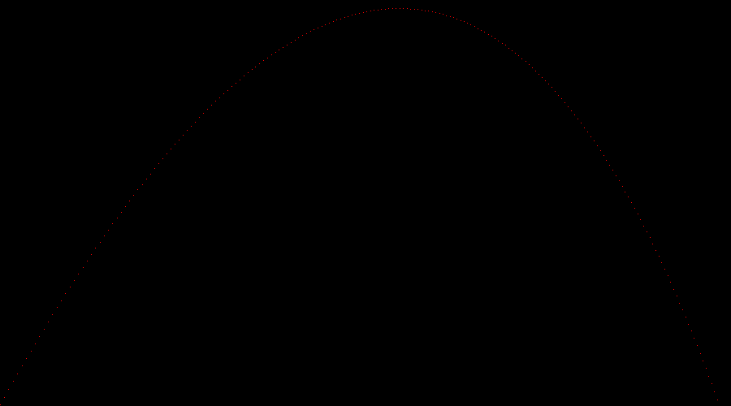
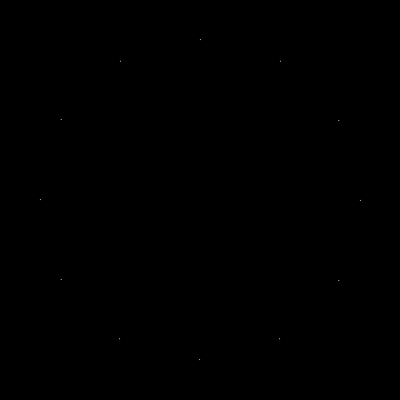
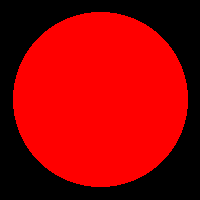

# The Ray Tracer Challenge

My take on Jamis Buck's ([@jamis](https://github.com/jamis)) awesome [ray tracer challenge](https://pragprog.com/book/jbtracer/the-ray-tracer-challenge)
in [ScalaJS](https://www.scala-js.org).

## State

### Chapters 1, 2
In chapters 1 and 2 I developed a basic implementation of vectors.
Image shows the trajectory of a flying projectile in an environment with gravity and wind.

 

### Chapters 3, 4
In chapters 3 and 4 I extended my vector implementation to a more full-blown linear algebra library.
It now supports matrix-multiplication-based geometric transformations like translation, scaling and rotation.
The image shows a simple clock face generated with these operations.

### Chapter 5
In chapter 5 I implemented the first actual ray tracing to draw the silhouette of a sphere.

